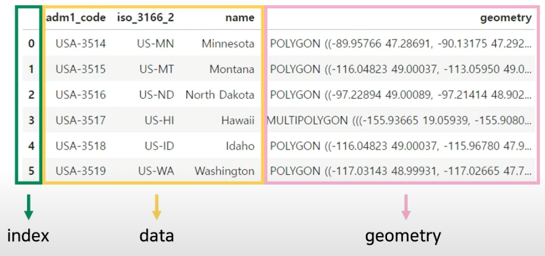
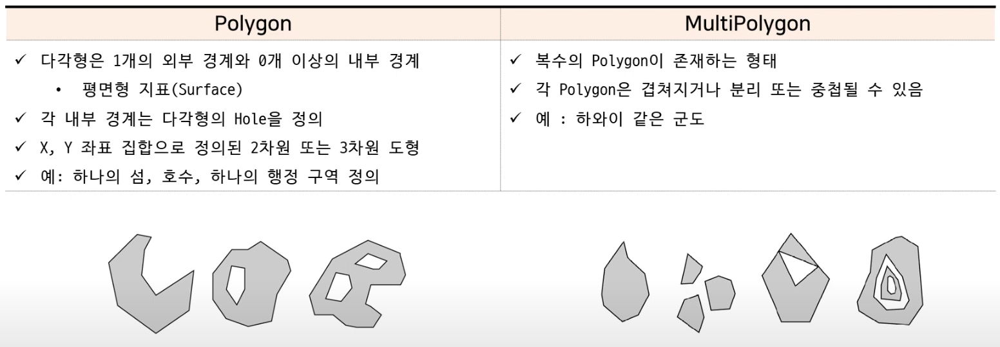

# GeoPandas

#### Raster vs. Vector
1. Raster
- 셀 또는 픽셀 그리드로 표현 
- .svg, .shp
2. Vector
- 점, 선, 다각형으로 표현 
- .jpg, .png, .tif

#### Shape file
- 지리 정보 시스템에 널리 사용되는 지리 공간 벡터 데이터 형식
- 확장자가 다른 세가지 파일로 구성 
    - 공간데이터(Data) : .shp, .shx 
    - 속성 정보(Information) : .dbf

#### CRS(Coordinate Reference System)
- 위도와 경도의 조합을 나타내는 좌표 체게
- 좌표 참조 시스템(CRS/PCS/VCS)

#### GeoPandas
- 기존 Pandas DataFrame의 index + data에서 확장한 것으로 geometry라는 특별한 열을 지님
- 추가된 컬럼 geometry는 shapely geometry 객체를 담고 있음.

#### Polygon vs. MultiPolygon
